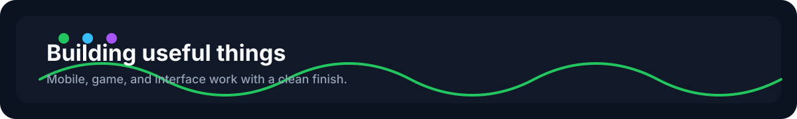

# denatril

Mobile and game developer building practical tools, polished interfaces, and small interactive experiences.

## What I Work On

- Mobile apps with a clean UX
- Game prototypes and gameplay systems
- React Native and Unity
- C# and JavaScript

## Recent Work

- Small apps that feel usable from day one
- Tools that make mobile and game workflows simpler
- Interactive UI and lightweight automation experiments

## Skills

- Frontend and app development
- Gameplay prototyping
- UI polish and product iteration
- C# and JavaScript

## Links

- LinkedIn: [oguzhanocakoglu](https://www.linkedin.com/in/oguzhanocakoglu)
- Email: oguzhanocakoglu@gmail.com

## Now

Building, learning, and shipping one project at a time.

## Languages & Tools

  
  
  
  
  
  

